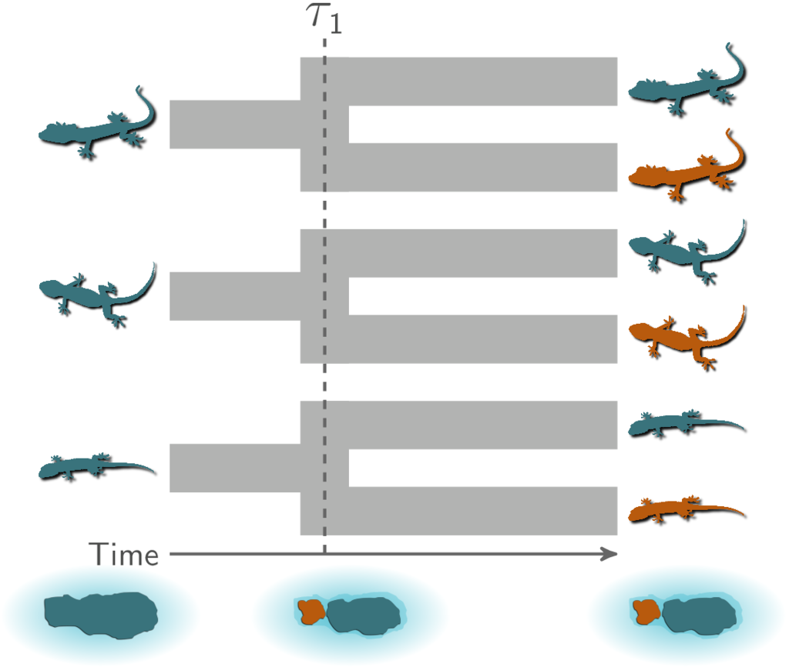
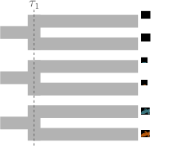
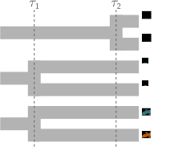
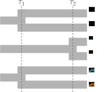
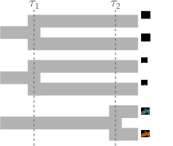
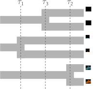
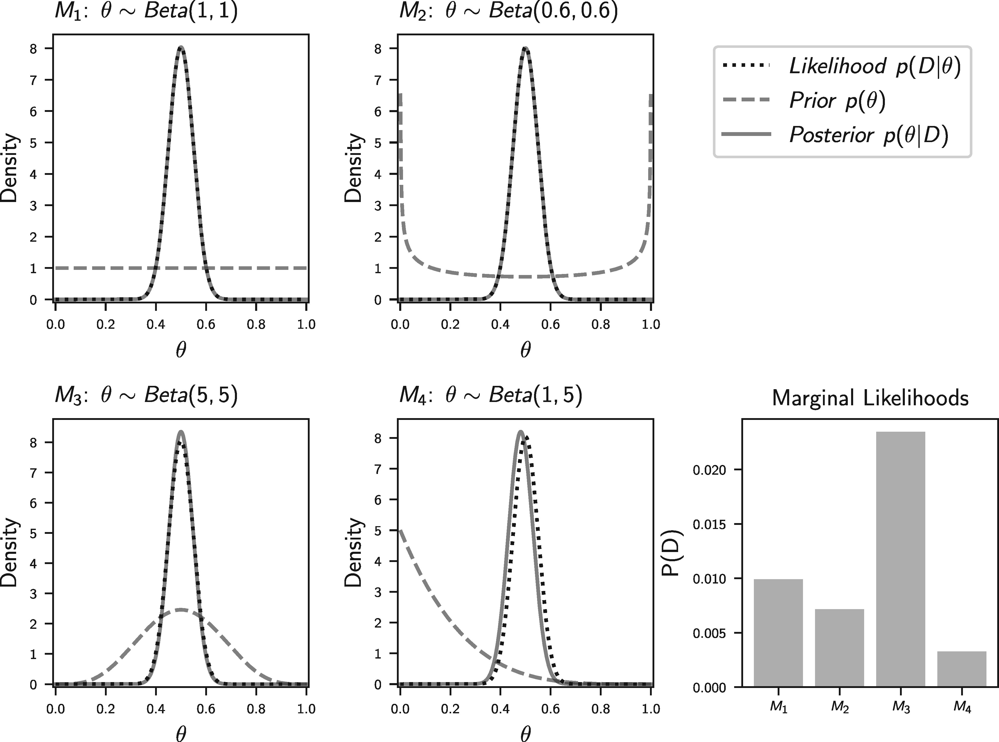

# Background

The primary goal of this project is to improve comparative biogeographical
estimation of shared (synchronous) population divergences or size changes
across taxa using genomic data.
We have implemented the models we will be testing in the software package
[ecoevolity](https://phyletica.org/ecoevolity).

The background information below will assume some knowledge of
the types of comparative biogeographic models implemented in
[ecoevolity](https://phyletica.org/ecoevolity).
The documentation provides a
[brief and gentle introduction to such models](https://phyletica.org/ecoevolity/ecoevolity/background.html).
For more details, please refer to
@Oaks2018ecoevolity, @Oaks2018paic, & @Oaks2019codemog.

[Ecoevolity](https://phyletica.org/ecoevolity)
estimates the relative timing of two types of evolutionary events among taxa:

1.  Population divergence [@Oaks2018ecoevolity].
2.  Change in the effective size of a population [@Oaks2019codemog].

Throughout this documentation, we will focus on divergences, but all the
comparative models we discuss and test also apply to changes in effective
population sizes (or a mix of divergences and size changes).

## A hypothetical example

As a hypothetical example,
let's imagine three pairs of lizard species that are co-distributed across two
islands.
We want to test the hypothesis that these three pairs of species diverged
when the islands were fragmented by rising sea levels 130,000 years ago.
This predicts that all three pairs of populations diverged at roughly the same
time on an evolutionary timescale.

{fig-alt="Three pairs of lizard species co-speciating when their island is fragmented" fig-align="center" width=70%}

To evaluate the probability of such a model of co-divergence,
we also need to consider other possible explanations (i.e., models).
For example, perhaps all of these populations were founded by random over-water
dispersal events, which we would not expect to be temporally clustered.
Or, perhaps two pairs of populations co-diverged when rising seas separated the
islands, but the third pair of lizards diverged at a different time via
dispersal.

With 3 pairs of lizards, there are 5 possible models to explain their
history of divergence times:

-   All 3 diverged at the same time
-   All 3 diverged independently
-   2 diverged together and the third independently; the independent diverger
    could have been any of the 3 pairs, so these comprise 3 models

Below are illustrations of these 5 models, where $\tau$ represents independent
divergence-time parameters.

{fig-alt="Three pairs of lizard species co-speciating" fig-align="center" width=60%}

{fig-alt="Two pairs of lizard species co-speciating" fig-align="center" width=60%}

{fig-alt="Two pairs of lizard species co-speciating" fig-align="center" width=60%}

{fig-alt="Two pairs of lizard species co-speciating" fig-align="center" width=60%}

{fig-alt="Three pairs of lizard species speciating independently" fig-align="center" width=60%}

The number of possible models is equal to the number of possible set partitions
of the taxa, which increases very rapidly as the number of taxa increases.

## Bayesian inference of divergence models

Bayesian model choice offers a way to determine the probability of
divergence models.
Such a Bayesian approach has been used with
simulation-based [@Hickerson2006;@Huang2011]
and
full-likelihood [@Oaks2018ecoevolity;@Oaks2019codemog]
methods.
It has been shown that these methods can be biased toward over-clustering
(i.e., underestimating the number of divergence times)
[@Oaks2012;@Oaks2014reply].

@Oaks2014reply proposed this tendency to prefer models with too few
divergence-time parameters was caused by the prior probability density placed
on the divergence times.
In Bayesian model choice, the likelihood of a model is averaged over the
priors, making the prior a "penalty" for adding parameters to the model.
Let's cover some basics of Bayesian inference to gain some intuition for why
this is.

## Basics of Bayesian statistical inference

Let's focus on the simplest possible model to explain the divergence of our 3
pairs of lizard species.
This simplest mode has a single parameter, $\tau$, the time of divergences
shared by all 3 pairs.
Bayes' rule tells us that the posterior probability density of $\tau$ is
proportional to the likelihood multiplied by the prior probability density

$$ p(\tau | D) = \frac{ p(D | \tau) p(\tau)}{ p(D) } $$,

where $D$ is the data.
The normalizing constant in the denominator ($p(D)$) is the marginal
probability of the data under our model:

$$ p(D) = \int_{\tau} p(D | \tau) p(\tau) d\tau $$.

This is an average over the entire parameter space of the likelihood weighted
by the prior.
This averaging is only in the normalizing constant, so the posterior
probability density of $\tau$ tends to be pretty robust to our choice of prior.
So, generally speaking, Bayesian parameter estimation tends to be pretty robust
to the priors on the parameters, assuming we have informative data.

However, this changes once we start comparing models.
To see this, let's first add some notation to our equations above to make it
explicit that the posterior is for our simple 1-parameter model, which we'll
denote $M_1$:

$$ p(\tau | D, M_1) = \frac{ p(D | \tau, M_1) p(\tau | M_1)}{ p(D | M_1) } $$

where

$$ p(D | M_1) = \int_{\tau} p(D | \tau, M_1) p(\tau | M_1) d\tau $$.

These equations are identical to the ones above.
We've just added some bookkeeping to make it explicit which model we're talking
about.

Now, let's consider a 3-parameter model, $M_2$, in which all 3 pairs diverge
independently:

$$ p(\tau_1, \tau_2, \tau_3 | D, M_2) = \frac{ p(D | \tau_1, \tau_2, \tau_3, M_2) p(\tau_1 | M_2) p(\tau_2 | M_2) p(\tau_3 | M_2)}{ p(D | M_2) } $$

where

$$ p(D | M_2) = \int_{\tau_1}\int_{\tau_2}\int_{\tau_3} p(D | \tau_1, \tau_2, \tau_3, M_2) p(\tau_1 | M_2) p(\tau_2 | M_2) p(\tau_3 | M_2) d\tau_1 d\tau_2 d\tau_3 $$.

Notice, for the marginal likelihood of $M_2$, we are now averaging over three
prior densities.
Assuming we are using the same prior on all three divergence times, we are
cubing the space over which the likelihood is averaged.
Again, if we just want to estimate the three divergence times under this model,
the posteriors of these three parameters will be pretty robust to our choice of
prior on $\tau$ (assuming our data are informative).

However, if we want to compare $M_1$ and $M_2$, the prior plays a much bigger
role.
Bayesian model choice is also based on Bayes' rule, but now we are interested
in the posterior probability of each model:

$$ p(M_1 | D) = \frac{ p(D | M_1) p(M_1)}{ p(D | M_1)p(M_1) + p(D | M_2)p(M_2) } $$.

Notice, the marginal likelihood of the model is now in the ***numerator***
of Bayes' rule; it's no longer just a normalizing constant!
By changing our focus from parameter estimation to model comparison,
we have moved into a world of averaged likelihoods.
Now, the priors we are averaging the likelihood over are super important, no
matter how informative our data are.
Choose a prior that places a bunch of density in regions of parameter space
with low likelihood, and you can create a crippling penalty against models with
more parameters.

So, if we don't know much *a priori* about the divergence times of our pairs,
and we choose a "vague" prior on divergence times to represent that
uncertainty, we can create a strong penalty against models with more divergence
time priors.

Let's look at a silly example of coin flipping to gain more intuition for the
differing influence of priors we place on parameters between Bayesian parameter
estimation and model choice

## A coin flipping example

This example is stolen from @Oaks2018marginal.
Let's use $\theta$ to represent the rate of a coin landing heads-side
up.
We will flip the coin 100 times and record the number of times it lands head
up, which we will model as a random outcome from a binomial distribution.
Before seeing the coin and flipping it, let's say we want to compare
four models that vary in our prior assumptions about the coin's rate of heads:

-   $M_1$: All values are equally probable; $\theta \sim \textrm{Beta}(1,1)$
-   $M_2$: It might be a trick coin, but we don't know if it's weighted toward heads or tails; $\theta \sim \textrm{Beta}(0.6,0.6)$
-   $M_3$: The coin is probably fair; $\theta \sim \textrm{Beta}(5,5)$
-   $M_4$: The coin is probably weighted toward tails; $\theta \sim \textrm{Beta}(1,5)$

If we happen to flip 50/100 heads, here's what our posterior distributions of
$\theta$ will look like, along with the marginal likelihoods of the four models
(from @Oaks2018marginal):

{fig-alt="Results of our coin-flipping experiment" fig-align="center" width=80%}

Notice, how the posterior estimates of $\theta$ are nearly identical across all
four models, but the average (marginal) likelihood of the models are very
different.
While silly, this is an example of how differently our choice of prior on a
parameter affects Bayesian parameter estimation vs model choice.

## What to do?

Okay, so putting a "vague" prior distribution on divergence times can create a
downward bias on the number of divergence times.
What can we do about this bias?

We could take an empirical Bayesian approach and use our data to inform the
"prior" we put on divergence times.
This is double-dipping, which could be okay if we just want point estimates of
parameters.
For example, if we cheated in our coin-flipping experiment above and added a
5th model that uses the posterior from $M_1$ as the prior, the mode of the
posterior under this 5th model will be nearly identical to the other four
models.
However, when comparing models, using the data twice can have a big influence
on the marginal likelihoods of the models.

All is not lost though.
We can use a hierarchical Bayesian approach to make estimating the prior
on divergence times part of the model.

## A hierarchical Bayesian approach

By using a hierarchical model, we can let the data tell us what the prior on
divergence times should be, without double dipping.
To get a sense for how this can work,
let's go back to our 3-parameter model from above, but add another level to the
model.
Let's use $\mu$ to represent the mean of the prior on all the divergence time
parameters.
Dropping the $M_2$ notation from above for simplicity, our hierarchical
3-parameter model will look like

$$ p(\tau_1, \tau_2, \tau_3, \mu | D) = \frac{ p(D | \tau_1, \tau_2, \tau_3) p(\tau_1 | \mu) p(\tau_2 | \mu) p(\tau_3 | \mu) p(\mu)}{ p(D) } $$

where

$$ p(D) = \int_{\tau_1}\int_{\tau_2}\int_{\tau_3}\int_{\mu} p(D | \tau_1, \tau_2, \tau_3) p(\tau_1 | \mu) p(\tau_2 | \mu) p(\tau_3 | \mu) d\tau_1 d\tau_2 d\tau_3 d\mu $$.

Notice that the mean of the divergence-time prior is one-level removed from
the data.
So, integrating $\mu$ does not directly involve the model likelihood.
This will allow the values of $\tau$ informed by our data (which remember, tend
to be robust to the prior) to inform the mean of the prior.
If our data suggest our prior on $\tau$ is "off", the second-level of the model
can learn this indirectly from the data.

